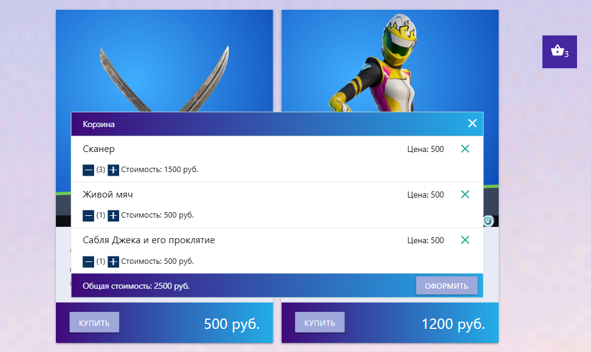

<h1 align="center">React-Shopcase</h1>

## Description

The project simulates a store of goods. The basis of the project is the use of hooks from the React library.

## About the project.
- The markup is implemented using the front-end framework Materialize (https://materializecss.com).
- The markup is drawn dynamically using React functional components, as well as using the useState hook.
- The goods data for this project is obtained from an open database https://fortniteapi.io. Requesting data using FETCH API.

- ## Adaptive design

The interface design is provided for various types of devices.

## **Desktop**

## **Mobile**

- ## The pop-up message when adding an item to the cart

- ## The basket

The basket displays the product name, price, quantity and total cost of the basket. In the shopping cart tab, you can add and subtract the amount of the added product, as well as delete the product from the basket.

- ## The pagination

## New changed

The ContextReducer branch has been added, where the project has been redesigned using the useContext and useReducer hooks instead of useState.

## I invite you to see my other projects.
